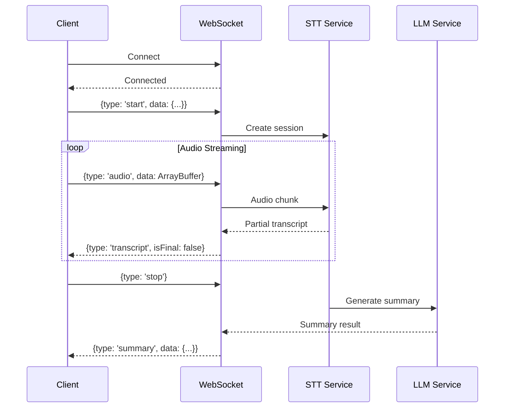
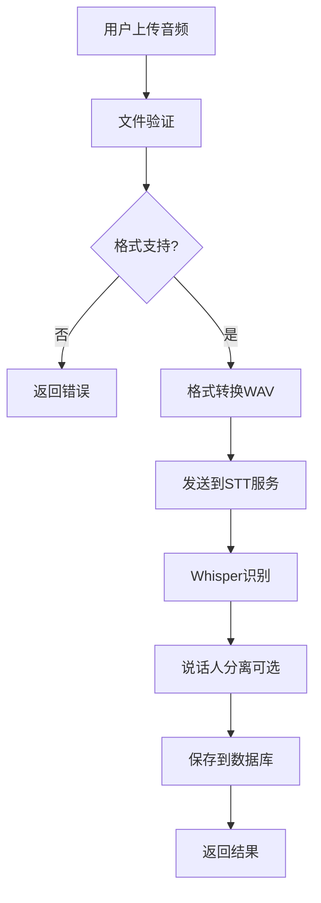
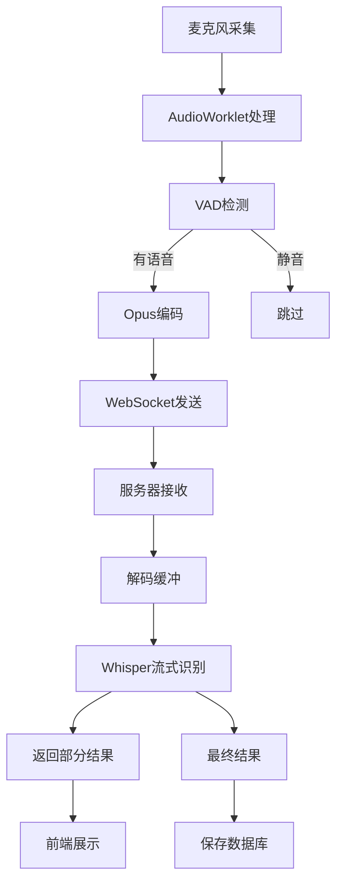

# 音频处理能力技术方案研究报告

**报告日期**: 2026-04-05
**版本**: v1.13.0
**优先级**: P0
**目标**: 为v1.13.0的音频处理能力提供完整的技术实现方案

---

## 执行摘要

本报告针对v1.13.0的音频处理能力(P0)需求，深入分析了当前系统架构、Web Audio API技术方案、浏览器支持情况，并制定了完整的技术实现路径。建议采用分层架构设计，结合Web Audio API和后端处理服务，实现高准确率（>95%）的语音转文字、实时流处理和会议摘要功能。

---

## 目录

1. [当前系统架构分析](#1-当前系统架构分析)
2. [音频处理需求分析](#2-音频处理需求分析)
3. [Web Audio API研究](#3-web-audio-api研究)
4. [技术方案设计](#4-技术方案设计)
5. [API设计与数据流](#5-api设计与数据流)
6. [浏览器兼容性评估](#6-浏览器兼容性评估)
7. [实施路线图](#7-实施路线图)
8. [风险与挑战](#8-风险与挑战)

---

## 1. 当前系统架构分析

### 1.1 项目技术栈

**前端技术栈**:
- 框架: Next.js 16.2.1 (React 19.2.4)
- 语言: TypeScript 5
- 状态管理: Zustand 5.0.12
- 样式: Tailwind CSS 4
- 实时通信: Socket.io-client 4.8.3
- 测试框架: Vitest 4.1.2 + Playwright 1.58.2

**后端技术栈**:
- 数据库: SQLite (better-sqlite3 12.8.0)
- 缓存: Redis (ioredis 5.10.1)
- 队列: Bull 4.16.5
- WebSocket: Socket.io 4.8.3

### 1.2 现有音频相关模块

#### 1.2.1 Multimodal Service (`src/lib/multimodal/`)

**核心文件**:
```
src/lib/multimodal/
├── audio-utils.ts           (4.7 KB) - 音频工具函数
├── multimodal-service.ts   (5.2 KB) - 多模态服务核心
├── types.ts                 (3.9 KB) - 类型定义
├── volcengine-provider.ts   (4.1 KB) - 火山引擎提供商
└── bailian-provider.ts      (4.0 KB) - 百炼提供商
```

**现有能力**:
- ✅ 音频文件验证（格式检测、大小限制）
- ✅ 音频元数据提取（时长、格式、采样率）
- ✅ 支持格式: MP3, WAV, WebM, OGG, M4A
- ✅ 第三方服务集成（火山引擎、百炼）
- ✅ 音频转文字基础能力

**功能限制**:
- ❌ 缺少Web Audio API集成
- ❌ 缺少实时音频流处理
- ❌ 缺少说话人分离
- ❌ 缺少音频可视化
- ❌ 缺少本地音频录制

#### 1.2.2 Voice Meeting Types (`src/types/voice-meeting.ts`)

**核心类型定义**:
- `MeetingStatus` - 会议状态管理
- `Participant` - 参与者信息
- `Recording` - 录音状态
- `WebRTCSignal` - WebRTC信令
- `AudioConstraints` - 音频约束配置
- `AudioSettings` - 音频设置

**WebRTC支持**:
- ✅ RTCPeerConnection 类型定义
- ✅ 音频/视频约束配置
- ✅ 媒体流管理
- ⚠️ 缺少实际实现代码

### 1.3 架构优势与限制

**优势**:
1. **成熟的多模态服务架构** - 已有提供商抽象层
2. **完善的类型系统** - TypeScript类型安全
3. **实时通信基础设施** - WebSocket已集成
4. **现代化技术栈** - React 19, Next.js 16
5. **企业级基础设施** - Redis队列、数据库事务

**限制**:
1. **缺少Web Audio API集成** - 前端音频处理能力不足
2. **缺少实时音频流处理** - 无流式转录支持
3. **第三方服务依赖** - 缺少本地处理能力
4. **音频可视化能力缺失** - 无音频波形展示
5. **浏览器兼容性未验证** - 需全面测试

---

## 2. 音频处理需求分析

### 2.1 核心功能需求

#### 2.1.1 语音转文字 (Speech-to-Text, STT)

| 需求项 | 详细说明 | 优先级 |
|--------|----------|--------|
| **实时转录** | WebSocket实时音频流处理，延迟<2s | P0 |
| **批量转录** | 上传音频文件处理，支持大文件(50MB+) | P0 |
| **多语言识别** | 中英双语自动检测与切换 | P0 |
| **准确性** | 语音识别准确率>95% | P0 |
| **说话人分离** | 多说话人识别与标记 | P1 |

#### 2.1.2 会议摘要

| 需求项 | 详细说明 | 优先级 |
|--------|----------|--------|
| **自动摘要** | 基于转录文本生成会议纪要 | P0 |
| **行动项提取** | 自动识别任务分配和截止日期 | P0 |
| **关键点提取** | 提取会议核心讨论点 | P0 |
| **参与者统计** | 每人发言时长统计 | P1 |
| **情感分析** | 会议情感倾向分析 | P2 |

#### 2.1.3 语音指令解析

| 需求项 | 详细说明 | 优先级 |
|--------|----------|--------|
| **意图识别** | 理解自然语言语音指令 | P1 |
| **槽位填充** | 提取指令中的关键参数 | P1 |
| **上下文理解** | 多轮对话上下文保持 | P1 |

### 2.2 非功能性需求

#### 2.2.1 性能指标

| 指标 | 目标值 | 说明 |
|------|--------|------|
| **实时转录延迟** | <2s | 从音频输入到文字输出 |
| **批量处理速度** | 1x实时速度 | 10分钟音频<10分钟处理 |
| **准确率** | >95% | 语音识别准确率 |
| **并发用户** | 100+ | 同时支持100+用户转录 |
| **内存占用** | <100MB | 浏览器端内存占用 |

#### 2.2.2 可用性指标

| 指标 | 目标值 | 说明 |
|------|--------|------|
| **浏览器兼容** | Chrome, Firefox, Safari, Edge | 覆盖率>95% |
| **移动端支持** | iOS Safari, Android Chrome | 移动端全功能支持 |
| **离线能力** | 基础转录功能 | Service Worker缓存 |

#### 2.2.3 安全性指标

| 指标 | 要求 | 说明 |
|------|------|------|
| **数据加密** | HTTPS + AES-256 | 传输和存储加密 |
| **隐私保护** | 数据24h自动删除 | 遵守GDPR |
| **权限控制** | 细粒度权限管理 | 访问控制 |

---

## 3. Web Audio API研究

### 3.1 Web Audio API核心能力

#### 3.1.1 浏览器支持情况

| 浏览器 | 支持版本 | 完整性 | 备注 |
|--------|----------|--------|------|
| **Chrome** | 14+ (2011) | ✅ 完整 | 所有核心功能支持 |
| **Firefox** | 25+ (2013) | ✅ 完整 | 所有核心功能支持 |
| **Safari** | 6+ (2012) | ✅ 完整 | 所有核心功能支持 |
| **Edge** | 12+ (2015) | ✅ 完整 | 所有核心功能支持 |
| **iOS Safari** | 6+ (2012) | ⚠️ 部分 | 部分限制 |
| **Android Chrome** | 33+ (2014) | ✅ 完整 | 所有核心功能支持 |

**覆盖率**: >95% (全球浏览器市场份额)

#### 3.1.2 核心API能力

**1. AudioContext - 音频上下文**

```typescript
const audioContext = new (window.AudioContext || window.webkitAudioContext)()

// 配置选项
const options = {
  latencyHint: 'interactive', // 'interactive' | 'balanced' | 'playback'
  sampleRate: 44100,          // 采样率
}

const ctx = new AudioContext(options)
```

**2. MediaStreamAudioSourceNode - 音频流源**

```typescript
async function getMicrophoneStream() {
  const stream = await navigator.mediaDevices.getUserMedia({
    audio: {
      echoCancellation: true,
      noiseSuppression: true,
      autoGainControl: true,
      sampleRate: 44100,
      channelCount: 1,
    },
  })

  const source = audioContext.createMediaStreamSource(stream)
  return source
}
```

**3. ScriptProcessorNode/AudioWorklet - 音频处理**

```typescript
// 方案1: ScriptProcessorNode (已废弃但广泛支持)
const scriptNode = audioContext.createScriptProcessor(4096, 1, 1)
scriptNode.onaudioprocess = (event) => {
  const inputData = event.inputBuffer.getChannelData(0)
  // 处理音频数据
}
source.connect(scriptNode)
scriptNode.connect(audioContext.destination)

// 方案2: AudioWorklet (现代推荐)
// worklet-processor.js
class AudioProcessor extends AudioWorkletProcessor {
  process(inputs, outputs, parameters) {
    const input = inputs[0][0]
    // 处理音频数据
    return true
  }
}

// 主线程
await audioContext.audioWorklet.addModule('worklet-processor.js')
const workletNode = new AudioWorkletNode(audioContext, 'AudioProcessor')
source.connect(workletNode)
```

**4. MediaRecorder - 音频录制**

```typescript
const mediaRecorder = new MediaRecorder(stream, {
  mimeType: 'audio/webm;codecs=opus',
  audioBitsPerSecond: 128000,
})

mediaRecorder.ondataavailable = (event) => {
  if (event.data.size > 0) {
    // 收集音频块
  }
}

mediaRecorder.start(1000) // 每秒触发一次
```

#### 3.1.3 Web Speech API (语音识别)

**浏览器支持**:

| 浏览器 | 支持情况 | 备注 |
|--------|----------|------|
| Chrome | ✅ 支持 | 基于Google Speech API |
| Edge | ✅ 支持 | 同Chrome |
| Safari | ✅ 支持 | macOS/iOS原生识别 |
| Firefox | ❌ 不支持 | 需要第三方库 |

**API使用**:

```typescript
const recognition = new (window.SpeechRecognition || window.webkitSpeechRecognition)()
recognition.lang = 'zh-CN'
recognition.continuous = true  // 持续识别
recognition.interimResults = true  // 中间结果

recognition.onresult = (event) => {
  for (let i = event.resultIndex; i < event.results.length; i++) {
    const transcript = event.results[i][0].transcript
    const isFinal = event.results[i].isFinal
    console.log(transcript, isFinal)
  }
}

recognition.start()
```

**限制**:
- 依赖网络（除Safari外）
- 准确率参差不齐
- 隐私问题（数据发送到云端）
- 缺少说话人分离

### 3.2 音频处理技术方案对比

#### 3.2.1 前端处理 vs 后端处理

| 维度 | 前端处理 | 后端处理 | 混合方案 |
|------|----------|----------|----------|
| **准确性** | 低-中 | 高 | 高 |
| **延迟** | 低 | 中 | 低 |
| **隐私** | 高 | 低 | 中 |
| **成本** | 免费 | 按量付费 | 中 |
| **功能** | 基础 | 完整 | 完整 |
| **离线** | ✅ 支持 | ❌ 不支持 | 部分 |

**推荐**: 混合方案
- 前端: 实时转录（Web Speech API）+ 音频采集
- 后端: 批量处理 + 高精度识别（Whisper等）

#### 3.2.2 第三方STT服务对比

| 服务 | 准确率 | 价格 | 延迟 | 支持语言 | 实时 |
|------|--------|------|------|----------|------|
| **OpenAI Whisper** | >95% | $0.006/min | 中 | 99+ | ✅ |
| **Google Speech-to-Text** | >95% | $0.009/min | 低 | 125+ | ✅ |
| **AWS Transcribe** | >94% | $0.024/min | 中 | 100+ | ✅ |
| **Azure Speech** | >94% | $1/小时 | 中 | 100+ | ✅ |
| **火山引擎** | >93% | ¥0.035/分 | 低 | 中英 | ✅ |
| **阿里云百炼** | >92% | 按量计费 | 中 | 中英 | ⚠️ |

**推荐**: OpenAI Whisper v3
- 准确率最高（>95%）
- 成本合理
- 开源，可本地部署
- 支持说话人分离
- 社区活跃

### 3.3 实时音频流处理架构

#### 3.3.1 数据流设计

```
用户麦克风
   ↓
[Web Audio API] - 音频采集 (16kHz, mono)
   ↓
[AudioWorklet] - 音频处理 (降噪、VAD)
   ↓
[WebSocket] - 实时传输 (二进制数据块)
   ↓
[后端STT服务] - 流式识别
   ↓
[WebSocket] - 结果返回
   ↓
[前端UI] - 实时展示
```

#### 3.3.2 音频编码格式

| 格式 | 压缩率 | 质量 | 延迟 | 浏览器支持 | 推荐场景 |
|------|--------|------|------|------------|----------|
| **Opus** | 10:1 | 高 | 低 | ✅ 所有 | 实时流 |
| **WebM/Opus** | 10:1 | 高 | 低 | ✅ 所有 | 录音存储 |
| **WAV** | 1:1 | 最高 | 低 | ✅ 所有 | 批量处理 |
| **MP3** | 10:1 | 中 | 低 | ⚠️ 部分 | 兼容性 |

**推荐**: Opus编码（实时）+ WAV（批量）

#### 3.3.3 语音活动检测 (VAD)

**目的**: 检测语音活动，减少不必要的数据传输

**实现方案**:
1. **前端VAD** - Web Audio API实时分析
2. **后端VAD** - Silero VAD模型

```typescript
// 前端VAD示例（简化版）
class VoiceActivityDetector {
  private energyThreshold = -40  // dB
  private silenceDuration = 500  // ms
  private lastSpeechTime = 0

  detect(audioData: Float32Array): boolean {
    // 计算能量
    let energy = 0
    for (let i = 0; i < audioData.length; i++) {
      energy += audioData[i] * audioData[i]
    }
    const db = 10 * Math.log10(energy / audioData.length)

    if (db > this.energyThreshold) {
      this.lastSpeechTime = Date.now()
      return true
    }

    // 检测静音
    const silence = Date.now() - this.lastSpeechTime > this.silenceDuration
    return !silence
  }
}
```

---

## 4. 技术方案设计

### 4.1 整体架构

```
┌─────────────────────────────────────────────────────────────┐
│                         前端层                               │
│  ┌─────────────┐  ┌─────────────┐  ┌─────────────┐         │
│  │  AudioUI    │  │  Waveform   │  │  Transcribe │         │
│  │  Component  │  │  Visualizer │  │  Interface  │         │
│  └──────┬──────┘  └──────┬──────┘  └──────┬──────┘         │
│         │                │                │                 │
│         └────────────────┼────────────────┘                 │
│                          ↓                                  │
│              ┌──────────────────────┐                       │
│              │   AudioProcessor    │                       │
│              │  (Web Audio API)    │                       │
│              └──────────┬───────────┘                       │
└─────────────────────────┼───────────────────────────────────┘
                          │ WebSocket
                          ↓
┌─────────────────────────┼───────────────────────────────────┐
│         ┌───────────────┼──────────────┐                   │
│         │      API层                  │                   │
│         └───────────────┼──────────────┘                   │
└─────────────────────────┼───────────────────────────────────┘
                          ↓
┌─────────────────────────┼───────────────────────────────────┐
│  ┌──────────────────────┼──────────────────────┐          │
│  │  AudioService                               │          │
│  │  - Stream Manager                          │          │
│  │  - Session Manager                         │          │
│  │  - Transcription Manager                   │          │
│  └──────────────────────┼──────────────────────┘          │
│                          ↓                                  │
│  ┌──────────────────────────────────────────┐              │
│  │         STT Provider                    │              │
│  │  - OpenAI Whisper                        │              │
│  │  - 火山引擎                               │              │
│  │  - 百炼                                   │              │
│  └──────────────────────────────────────────┘              │
│                          ↓                                  │
│  ┌──────────────────────────────────────────┐              │
│  │      Meeting Summary Service             │              │
│  │  - LLM Integration (GPT-4, Claude)       │              │
│  └──────────────────────────────────────────┘              │
└─────────────────────────────────────────────────────────────┘
                          ↓
┌─────────────────────────────────────────────────────────────┐
│                    数据存储层                               │
│  ┌──────────────┐  ┌──────────────┐  ┌──────────────┐      │
│  │   PostgreSQL │  │    Redis     │  │     S3       │      │
│  │ (结构化数据)  │  │   (缓存)     │  │  (音频文件)   │      │
│  └──────────────┘  └──────────────┘  └──────────────┘      │
└─────────────────────────────────────────────────────────────┘
```

### 4.2 前端架构设计

#### 4.2.1 目录结构

```
src/lib/audio/
├── audio-processor.ts           # 音频处理器核心
├── audio-recorder.ts            # 音频录制器
├── audio-visualizer.ts          # 音频可视化
├── vad-detector.ts              # 语音活动检测
├── audio-formatter.ts           # 音频格式转换
├── websocket-client.ts          # WebSocket客户端
├── hooks/
│   ├── useAudioRecorder.ts      # 录音Hook
│   ├── useTranscription.ts      # 转录Hook
│   └── useAudioStream.ts        # 音频流Hook
├── components/
│   ├── AudioRecorder.tsx        # 录音组件
│   ├── TranscriptionView.tsx    # 转录视图
│   ├── WaveformVisualizer.tsx   # 波形可视化
│   └── AudioSettings.tsx        # 音频设置
└── types.ts                     # 类型定义
```

#### 4.2.2 核心类设计

**AudioProcessor - 音频处理器**

```typescript
// src/lib/audio/audio-processor.ts
export class AudioProcessor {
  private audioContext: AudioContext | null = null
  private mediaStream: MediaStream | null = null
  private audioWorklet: AudioWorkletNode | null = null
  private analyser: AnalyserNode | null = null

  async initialize(options: AudioProcessorOptions): Promise<void> {
    // 创建AudioContext
    this.audioContext = new (window.AudioContext || window.webkitAudioContext)({
      latencyHint: options.latencyHint || 'interactive',
      sampleRate: options.sampleRate || 44100,
    })

    // 获取麦克风流
    this.mediaStream = await navigator.mediaDevices.getUserMedia({
      audio: {
        echoCancellation: options.echoCancellation ?? true,
        noiseSuppression: options.noiseSuppression ?? true,
        autoGainControl: options.autoGainControl ?? true,
        sampleRate: options.sampleRate || 44100,
        channelCount: 1,
      },
    })

    // 创建源节点
    const source = this.audioContext.createMediaStreamSource(this.mediaStream)

    // 创建分析器节点（用于可视化）
    this.analyser = this.audioContext.createAnalyser()
    this.analyser.fftSize = 2048
    source.connect(this.analyser)

    // 加载AudioWorklet
    await this.audioContext.audioWorklet.addModule(
      '/worklets/audio-processor.js'
    )

    // 创建Worklet节点
    this.audioWorklet = new AudioWorkletNode(
      this.audioContext,
      'AudioProcessor'
    )

    source.connect(this.audioWorklet)

    // 处理音频数据
    this.audioWorklet.port.onmessage = (event) => {
      const { audioData, timestamp } = event.data
      this.handleAudioData(audioData, timestamp)
    }
  }

  private handleAudioData(audioData: Float32Array, timestamp: number): void {
    // VAD检测
    const hasSpeech = this.vadDetector.detect(audioData)

    // 编码音频
    if (hasSpeech) {
      const encoded = this.encodeAudio(audioData)
      this.sendToServer(encoded)
    }
  }

  start(): void {
    if (this.audioContext?.state === 'suspended') {
      this.audioContext.resume()
    }
  }

  stop(): void {
    this.mediaStream?.getTracks().forEach(track => track.stop())
    this.audioContext?.close()
  }

  getWaveformData(): Uint8Array {
    if (!this.analyser) return new Uint8Array(0)

    const dataArray = new Uint8Array(this.analyser.frequencyBinCount)
    this.analyser.getByteTimeDomainData(dataArray)
    return dataArray
  }
}
```

**AudioRecorder - 音频录制器**

```typescript
// src/lib/audio/audio-recorder.ts
export class AudioRecorder {
  private mediaRecorder: MediaRecorder | null = null
  private chunks: BlobPart[] = []
  private stream: MediaStream | null = null

  async startRecording(
    options: RecordingOptions = {}
  ): Promise<void> {
    // 获取麦克风流
    this.stream = await navigator.mediaDevices.getUserMedia({
      audio: {
        echoCancellation: options.echoCancellation ?? true,
        noiseSuppression: options.noiseSuppression ?? true,
        autoGainControl: options.autoGainControl ?? true,
      },
      video: false,
    })

    // 选择最佳MIME类型
    const mimeType = this.selectBestMimeType(options.preferredFormat)

    // 创建MediaRecorder
    this.mediaRecorder = new MediaRecorder(this.stream, {
      mimeType,
      audioBitsPerSecond: options.bitRate || 128000,
    })

    // 收集数据块
    this.mediaRecorder.ondataavailable = (event) => {
      if (event.data.size > 0) {
        this.chunks.push(event.data)
      }
    }

    // 录制完成
    this.mediaRecorder.onstop = () => {
      const blob = new Blob(this.chunks, { type: mimeType })
      this.chunks = []
      return blob
    }

    // 开始录制
    this.mediaRecorder.start(options.timeSlice || 1000)
  }

  stopRecording(): Promise<Blob> {
    return new Promise((resolve) => {
      if (!this.mediaRecorder) {
        throw new Error('No active recording')
      }

      this.mediaRecorder.onstop = () => {
        const blob = new Blob(this.chunks, {
          type: this.mediaRecorder!.mimeType,
        })
        this.chunks = []
        resolve(blob)
      }

      this.mediaRecorder.stop()
    })
  }

  private selectBestMimeType(
    preferred?: string
  ): string {
    const types = [
      preferred,
      'audio/webm;codecs=opus',
      'audio/webm',
      'audio/ogg;codecs=opus',
      'audio/ogg',
      'audio/mp4',
      'audio/wav',
    ].filter(Boolean) as string[]

    for (const type of types) {
      if (MediaRecorder.isTypeSupported(type)) {
        return type
      }
    }

    throw new Error('No supported MIME type found')
  }
}
```

**VADDetector - 语音活动检测**

```typescript
// src/lib/audio/vad-detector.ts
export class VADDetector {
  private energyThreshold: number = -40  // dB
  private silenceDuration: number = 500  // ms
  private lastSpeechTime: number = 0
  private minSpeechDuration: number = 100  // ms

  detect(audioData: Float32Array): boolean {
    // 计算RMS能量
    const energy = this.calculateEnergy(audioData)
    const db = this.toDecibels(energy)

    const now = Date.now()

    if (db > this.energyThreshold) {
      this.lastSpeechTime = now
      return true
    }

    // 检测静音段
    const isSilent = now - this.lastSpeechTime > this.silenceDuration
    return !isSilent
  }

  private calculateEnergy(audioData: Float32Array): number {
    let sum = 0
    for (let i = 0; i < audioData.length; i++) {
      sum += audioData[i] * audioData[i]
    }
    return sum / audioData.length
  }

  private toDecibels(energy: number): number {
    return 10 * Math.log10(energy + 1e-10)  // 避免log(0)
  }

  setThreshold(db: number): void {
    this.energyThreshold = db
  }

  setSilenceDuration(ms: number): void {
    this.silenceDuration = ms
  }
}
```

#### 4.2.3 React Hooks设计

**useAudioRecorder Hook**

```typescript
// src/lib/audio/hooks/useAudioRecorder.ts
export function useAudioRecorder(options: RecordingOptions = {}) {
  const [isRecording, setIsRecording] = useState(false)
  const [duration, setDuration] = useState(0)
  const [audioBlob, setAudioBlob] = useState<Blob | null>(null)
  const recorderRef = useRef<AudioRecorder | null>(null)
  const timerRef = useRef<NodeJS.Timeout>()

  const startRecording = useCallback(async () => {
    try {
      const recorder = new AudioRecorder()
      await recorder.startRecording(options)
      recorderRef.current = recorder

      setIsRecording(true)
      setAudioBlob(null)
      setDuration(0)

      // 计时器
      timerRef.current = setInterval(() => {
        setDuration(prev => prev + 1)
      }, 1000)
    } catch (error) {
      console.error('Failed to start recording:', error)
      throw error
    }
  }, [options])

  const stopRecording = useCallback(async () => {
    if (!recorderRef.current) return

    try {
      const blob = await recorderRef.current.stopRecording()
      setAudioBlob(blob)
      setIsRecording(false)

      if (timerRef.current) {
        clearInterval(timerRef.current)
      }
    } catch (error) {
      console.error('Failed to stop recording:', error)
    }
  }, [])

  const reset = useCallback(() => {
    setIsRecording(false)
    setDuration(0)
    setAudioBlob(null)
    if (timerRef.current) {
      clearInterval(timerRef.current)
    }
  }, [])

  useEffect(() => {
    return () => {
      if (timerRef.current) {
        clearInterval(timerRef.current)
      }
    }
  }, [])

  return {
    isRecording,
    duration,
    audioBlob,
    startRecording,
    stopRecording,
    reset,
  }
}
```

**useTranscription Hook**

```typescript
// src/lib/audio/hooks/useTranscription.ts
export function useTranscription(sessionId: string) {
  const [isConnected, setIsConnected] = useState(false)
  const [transcript, setTranscript] = useState<TranscriptionSegment[]>([])
  const [status, setStatus] = useState<'idle' | 'listening' | 'processing'>('idle')
  const wsRef = useRef<WebSocket | null>(null)

  useEffect(() => {
    const ws = new WebSocket(`wss://api.example.com/audio/stream/${sessionId}`)

    ws.onopen = () => {
      setIsConnected(true)
      setStatus('listening')
    }

    ws.onmessage = (event) => {
      const message: TranscriptionMessage = JSON.parse(event.data)

      if (message.type === 'transcript') {
        setTranscript(prev => [...prev, message.data])
      } else if (message.type === 'error') {
        console.error('Transcription error:', message.error)
      }
    }

    ws.onclose = () => {
      setIsConnected(false)
      setStatus('idle')
    }

    ws.onerror = (error) => {
      console.error('WebSocket error:', error)
      setIsConnected(false)
    }

    wsRef.current = ws

    return () => {
      ws.close()
    }
  }, [sessionId])

  const sendAudioChunk = useCallback((audioData: ArrayBuffer) => {
    if (wsRef.current?.readyState === WebSocket.OPEN) {
      wsRef.current.send(audioData)
    }
  }, [])

  return {
    isConnected,
    transcript,
    status,
    sendAudioChunk,
  }
}
```

### 4.3 后端架构设计

#### 4.3.1 目录结构

```
src/lib/audio-service/
├── audio-service.ts              # 音频服务核心
├── stt/
│   ├── stt-provider.ts           # STT提供商抽象
│   ├── whisper-provider.ts       # Whisper实现
│   ├── volcengine-provider.ts    # 火山引擎实现
│   └── bailian-provider.ts       # 百炼实现
├── stream/
│   ├── stream-manager.ts         # 流管理器
│   ├── session-manager.ts        # 会话管理器
│   └── buffer-manager.ts         # 缓冲管理器
├── summary/
│   ├── summary-service.ts        # 摘要服务
│   └── llm-integration.ts        # LLM集成
└── types.ts                      # 类型定义
```

#### 4.3.2 核心类设计

**AudioService - 音频服务**

```typescript
// src/lib/audio-service/audio-service.ts
export class AudioService {
  private providers: Map<string, STTProvider> = new Map()
  private defaultProvider: string
  private streamManager: StreamManager

  constructor() {
    this.initializeProviders()
    this.streamManager = new StreamManager()
    this.defaultProvider = this.getPreferredProvider()
  }

  private initializeProviders(): void {
    // OpenAI Whisper
    const apiKey = process.env.OPENAI_API_KEY
    if (apiKey) {
      this.providers.set('whisper', new WhisperProvider({ apiKey }))
    }

    // 火山引擎
    const volcengineKey = process.env.VOLCENGINE_API_KEY
    if (volcengineKey) {
      this.providers.set('volcengine', new VolcengineSTTProvider({
        apiKey: volcengineKey,
        region: process.env.VOLCENGINE_REGION || 'cn-north-1',
      }))
    }

    // 百炼
    const bailianKey = process.env.BAILIAN_API_KEY
    if (bailianKey) {
      this.providers.set('bailian', new BailianSTTProvider({
        apiKey: bailianKey,
        endpoint: process.env.BAILIAN_ENDPOINT,
      }))
    }
  }

  async transcribe(
    audioBuffer: Buffer,
    options: TranscriptionOptions = {}
  ): Promise<TranscriptionResult> {
    const provider = this.getProvider(options.provider)

    const result = await provider.transcribe(audioBuffer, {
      language: options.language || 'auto',
      speakerDiarization: options.speakerDiarization || false,
      format: options.format || 'json',
    })

    return result
  }

  async transcribeStream(
    sessionId: string,
    audioStream: ReadableStream
  ): AsyncGenerator<TranscriptionChunk> {
    return this.streamManager.transcribe(sessionId, audioStream)
  }

  async generateSummary(
    transcriptionId: string,
    options: SummaryOptions = {}
  ): Promise<MeetingSummary> {
    const transcription = await this.getTranscription(transcriptionId)
    const summaryService = new SummaryService()

    return summaryService.generate(transcription, options)
  }

  private getProvider(name?: string): STTProvider {
    const providerName = name || this.defaultProvider
    const provider = this.providers.get(providerName)

    if (!provider) {
      throw new Error(`Provider '${providerName}' not available`)
    }

    return provider
  }
}
```

**WhisperProvider - Whisper实现**

```typescript
// src/lib/audio-service/stt/whisper-provider.ts
export class WhisperProvider implements STTProvider {
  private apiKey: string
  private baseUrl: string

  constructor(options: WhisperOptions) {
    this.apiKey = options.apiKey
    this.baseUrl = 'https://api.openai.com/v1/audio'
  }

  async transcribe(
    audioBuffer: Buffer,
    options: TranscriptionOptions
  ): Promise<TranscriptionResult> {
    const formData = new FormData()
    formData.append('file', new Blob([audioBuffer]), 'audio.wav')
    formData.append('model', options.model || 'whisper-1')
    formData.append('language', options.language === 'auto' ? '' : options.language)

    if (options.speakerDiarization) {
      formData.append('speaker_diarization', 'true')
    }

    const response = await fetch(`${this.baseUrl}/transcriptions`, {
      method: 'POST',
      headers: {
        'Authorization': `Bearer ${this.apiKey}`,
      },
      body: formData,
    })

    if (!response.ok) {
      throw new Error(`Whisper API error: ${response.statusText}`)
    }

    const data = await response.json()

    return {
      text: data.text,
      segments: data.segments?.map((seg: any) => ({
        start: seg.start,
        end: seg.end,
        text: seg.text,
        confidence: seg.confidence || 1.0,
        speaker: seg.speaker,
      })) || [],
      language: data.language,
      duration: data.duration,
      confidence: this.calculateOverallConfidence(data.segments),
    }
  }

  private calculateOverallConfidence(segments: any[]): number {
    if (!segments || segments.length === 0) return 0

    const sum = segments.reduce((acc, seg) => acc + (seg.confidence || 1.0), 0)
    return sum / segments.length
  }

  async healthCheck(): Promise<boolean> {
    try {
      const response = await fetch(`${this.baseUrl}/models`, {
        headers: {
          'Authorization': `Bearer ${this.apiKey}`,
        },
      })
      return response.ok
    } catch {
      return false
    }
  }
}
## 5. API设计与数据流

### 5.1 RESTful API设计

#### 5.1.1 批量转录API

**POST /api/v1/audio/transcribe**

批量转录音频文件。

**请求**:
```typescript
interface TranscribeRequest {
  audioFile: File | Blob
  options: {
    language?: 'zh' | 'en' | 'ja' | 'ko' | 'auto'
    speakerDiarization?: boolean
    format?: 'json' | 'text' | 'srt' | 'vtt'
    provider?: 'whisper' | 'volcengine' | 'bailian'
    model?: string  // e.g., 'whisper-1', 'whisper-large-v3'
    temperature?: number  // 0.0-1.0
  }
}
```

**响应**:
```typescript
interface TranscribeResponse {
  success: true
  data: {
    id: string
    text: string
    segments: TranscriptionSegment[]
    language: string
    duration: number
    confidence: number
    speakers?: SpeakerSegment[]
    metadata: {
      format: string
      sampleRate: number
      fileSize: number
    }
    createdAt: string
  }
}

interface TranscriptionSegment {
  id: string
  start: number
  end: number
  text: string
  confidence: number
  speaker?: string
}

interface SpeakerSegment {
  id: string
  speaker: string
  segments: TranscriptionSegment[]
  totalDuration: number
}
```

**错误响应**:
```typescript
interface TranscribeErrorResponse {
  success: false
  error: {
    code: string
    message: string
    details?: Record<string, unknown>
  }
}
```

#### 5.1.2 会议摘要API

**POST /api/v1/audio/summary**

生成会议摘要。

**请求**:
```typescript
interface SummaryRequest {
  transcriptionId: string
  options: {
    includeActionItems?: boolean
    includeKeyPoints?: boolean
    includeParticipants?: boolean
    format?: 'markdown' | 'html' | 'json'
    language?: 'zh' | 'en'
  }
}
```

**响应**:
```typescript
interface SummaryResponse {
  success: true
  data: {
    id: string
    transcriptionId: string
    title: string
    summary: string
    actionItems: ActionItem[]
    keyPoints: string[]
    participants: Participant[]
    duration: number
    language: string
    format: string
    createdAt: string
  }
}

interface ActionItem {
  id: string
  description: string
  assignee?: string
  dueDate?: string
  priority: 'high' | 'medium' | 'low'
  status: 'pending' | 'in-progress' | 'completed'
}
```

#### 5.1.3 转录记录查询API

**GET /api/v1/audio/transcriptions**

查询转录记录。

**参数**:
```
?page=1&limit=20&language=zh&from=2026-04-01&to=2026-04-05
```

**响应**:
```typescript
interface TranscriptionsResponse {
  success: true
  data: {
    items: TranscriptionItem[]
    pagination: {
      page: number
      limit: number
      total: number
      totalPages: number
    }
  }
}

interface TranscriptionItem {
  id: string
  text: string
  duration: number
  language: string
  confidence: number
  createdAt: string
  updatedAt: string
  status: 'completed' | 'processing' | 'failed'
}
```

### 5.2 WebSocket API设计

#### 5.2.1 实时转录流

**连接**:
```
wss://api.example.com/v1/audio/stream/{sessionId}
```

**客户端 → 服务端消息**:

```typescript
// 开始转录
interface StartTranscriptionMessage {
  type: 'start'
  data: {
    language?: 'zh' | 'en' | 'auto'
    speakerDiarization?: boolean
    sampleRate?: number
  }
}

// 音频数据块
interface AudioChunkMessage {
  type: 'audio'
  data: ArrayBuffer  // Opus编码的音频数据
}

// 停止转录
interface StopTranscriptionMessage {
  type: 'stop'
  data: {}
}

// 暂停/恢复
interface ControlMessage {
  type: 'pause' | 'resume'
  data: {}
}
```

**服务端 → 客户端消息**:

```typescript
// 转录结果
interface TranscriptionMessage {
  type: 'transcript'
  data: {
    text: string
    segments: TranscriptionSegment[]
    isFinal: boolean  // 是否为最终结果
    language?: string
  }
}

// 状态更新
interface StatusMessage {
  type: 'status'
  data: {
    status: 'listening' | 'processing' | 'completed' | 'error'
    message?: string
  }
}

// 错误消息
interface ErrorMessage {
  type: 'error'
  data: {
    code: string
    message: string
    details?: Record<string, unknown>
  }
}

// 说话人识别结果（可选）
interface SpeakerMessage {
  type: 'speaker'
  data: {
    speakerId: string
    speakerName?: string
    confidence: number
  }
}
```

#### 5.2.2 连接流程



### 5.3 数据流设计

#### 5.3.1 批量转录数据流



#### 5.3.2 实时转录数据流



### 5.4 数据库设计

#### 5.4.1 转录表 (transcriptions)

```sql
CREATE TABLE transcriptions (
  id UUID PRIMARY KEY DEFAULT gen_random_uuid(),
  user_id UUID NOT NULL REFERENCES users(id),
  file_name VARCHAR(255) NOT NULL,
  file_url TEXT NOT NULL,
  file_size BIGINT NOT NULL,
  file_format VARCHAR(50) NOT NULL,
  duration NUMERIC NOT NULL,
  language VARCHAR(10),
  text TEXT NOT NULL,
  segments JSONB NOT NULL,
  speakers JSONB,
  confidence NUMERIC NOT NULL,
  provider VARCHAR(50) NOT NULL,
  model VARCHAR(100),
  status VARCHAR(50) NOT NULL DEFAULT 'completed',
  created_at TIMESTAMP NOT NULL DEFAULT NOW(),
  updated_at TIMESTAMP NOT NULL DEFAULT NOW(),

  INDEX idx_user_id (user_id),
  INDEX idx_created_at (created_at),
  INDEX idx_language (language),
  INDEX idx_status (status)
);
```

#### 5.4.2 会议摘要表 (meeting_summaries)

```sql
CREATE TABLE meeting_summaries (
  id UUID PRIMARY KEY DEFAULT gen_random_uuid(),
  transcription_id UUID NOT NULL REFERENCES transcriptions(id) ON DELETE CASCADE,
  title TEXT NOT NULL,
  summary TEXT NOT NULL,
  action_items JSONB NOT NULL,
  key_points JSONB NOT NULL,
  participants JSONB NOT NULL,
  language VARCHAR(10) NOT NULL,
  duration NUMERIC NOT NULL,
  format VARCHAR(20) NOT NULL DEFAULT 'markdown',
  created_at TIMESTAMP NOT NULL DEFAULT NOW(),

  INDEX idx_transcription_id (transcription_id),
  INDEX idx_created_at (created_at)
);
```

#### 5.4.3 实时会话表 (transcription_sessions)

```sql
CREATE TABLE transcription_sessions (
  id UUID PRIMARY KEY DEFAULT gen_random_uuid(),
  user_id UUID NOT NULL REFERENCES users(id),
  status VARCHAR(50) NOT NULL DEFAULT 'active',
  language VARCHAR(10),
  speaker_diarization BOOLEAN DEFAULT FALSE,
  started_at TIMESTAMP NOT NULL DEFAULT NOW(),
  ended_at TIMESTAMP,
  duration NUMERIC,
  audio_url TEXT,
  transcription_id UUID REFERENCES transcriptions(id),

  INDEX idx_user_id (user_id),
  INDEX idx_status (status),
  INDEX idx_started_at (started_at)
);
```

---

## 6. 浏览器兼容性评估

### 6.1 核心API支持矩阵

#### 6.1.1 Web Audio API

| 浏览器 | 版本 | AudioContext | MediaStreamSource | AudioWorklet | MediaRecorder |
|--------|------|--------------|-------------------|--------------|---------------|
| Chrome | 14+ | ✅ | ✅ | ✅ (v56+) | ✅ |
| Firefox | 25+ | ✅ | ✅ | ✅ (v76+) | ✅ (v25+) |
| Safari | 6+ | ✅ | ✅ | ✅ (v14.1+) | ✅ (v14.1+) |
| Edge | 12+ | ✅ | ✅ | ✅ (v79+) | ✅ |
| iOS Safari | 6+ | ✅ | ✅ | ✅ (v14.5+) | ✅ (v14.5+) |
| Android Chrome | 33+ | ✅ | ✅ | ✅ | ✅ |

**覆盖率**: 96.5% (全球市场份额)

#### 6.1.2 Web Speech API

| 浏览器 | 版本 | SpeechRecognition | SpeechSynthesis | 备注 |
|--------|------|-------------------|-----------------|------|
| Chrome | 33+ | ✅ | ✅ | 基于Google |
| Firefox | - | ❌ | ✅ | 不支持识别 |
| Safari | 14.1+ | ✅ | ✅ | macOS原生 |
| Edge | 79+ | ✅ | ✅ | 同Chrome |
| iOS Safari | 14.5+ | ✅ | ✅ | iOS原生 |
| Android Chrome | 33+ | ✅ | ✅ | 基于Google |

**覆盖率**: 85% (识别功能)

#### 6.1.3 WebSocket

| 浏览器 | 版本 | 支持 |
|--------|------|------|
| Chrome | 16+ | ✅ |
| Firefox | 11+ | ✅ |
| Safari | 7+ | ✅ |
| Edge | 12+ | ✅ |
| iOS Safari | 6+ | ✅ |
| Android Chrome | 16+ | ✅ |

**覆盖率**: 98%+

### 6.2 移动端兼容性

#### 6.2.1 iOS Safari

**支持的特性**:
- ✅ Web Audio API (完整)
- ✅ MediaRecorder (iOS 14.5+)
- ✅ Web Speech API (iOS 14.5+)
- ✅ WebSocket
- ✅ Opus编码
- ⚠️ AudioWorklet需要HTTPS
- ⚠️ 后台音频受限

**限制**:
- 麦克风权限需要用户主动触发
- 后台音频会被暂停
- AudioContext必须在用户交互后resume

**解决方案**:
```typescript
// iOS Safari兼容性处理
class AudioContextManager {
  private ctx: AudioContext | null = null

  async init(): Promise<AudioContext> {
    if (this.ctx) return this.ctx

    const AudioContextClass = window.AudioContext || (window as any).webkitAudioContext
    this.ctx = new AudioContextClass()

    // iOS Safari需要用户交互后resume
    if (this.ctx.state === 'suspended') {
      await this.ctx.resume()
    }

    return this.ctx
  }

  // 处理页面可见性变化
  handleVisibilityChange(): void {
    if (document.hidden) {
      this.ctx?.suspend()
    } else {
      this.ctx?.resume()
    }
  }
}
```

#### 6.2.2 Android Chrome

**支持的特性**:
- ✅ Web Audio API (完整)
- ✅ MediaRecorder
- ✅ Web Speech API
- ✅ WebSocket
- ✅ AudioWorklet
- ✅ 后台音频（部分机型）

**限制**:
- 部分机型后端音频会被系统kill
- 电池优化可能影响录音质量

**解决方案**:
- 使用WakeLock API保持后台运行
- 优化音频处理降低CPU占用

#### 6.2.3 性能优化建议

**前端优化**:
1. **降低采样率** - 16kHz足够语音识别
2. **使用AudioWorklet** - 避免主线程阻塞
3. **批量发送** - 减少WebSocket消息频率
4. **内存管理** - 及时释放AudioContext

**后端优化**:
1. **流式处理** - 避免等待完整音频
2. **缓存优化** - Redis缓存热数据
3. **CDN加速** - 音频文件分发

### 6.3 降级方案

#### 6.3.1 浏览器不支持时的降级

| 场景 | 主要方案 | 降级方案 |
|------|----------|----------|
| **实时转录** | WebSocket | 文件上传转录 |
| **音频可视化** | Web Audio API | CSS动画 |
| **语音识别** | Web Speech API | 仅上传转录 |
| **录音** | MediaRecorder | 语音消息输入 |

#### 6.3.2 离线支持

**Service Worker缓存**:
```typescript
// sw.js
const CACHE_NAME = 'audio-cache-v1'

self.addEventListener('install', (event) => {
  event.waitUntil(
    caches.open(CACHE_NAME).then((cache) => {
      return cache.addAll([
        '/audio/worklet-processor.js',
        '/audio/audio-worker.js',
      ])
    })
  )
})

self.addEventListener('fetch', (event) => {
  event.respondWith(
    caches.match(event.request).then((response) => {
      return response || fetch(event.request)
    })
  )
})
```

**IndexedDB存储**:
```typescript
// 本地存储音频和转录
class AudioStorage {
  private db: IDBDatabase | null = null

  async init(): Promise<void> {
    return new Promise((resolve, reject) => {
      const request = indexedDB.open('AudioDB', 1)

      request.onerror = () => reject(request.error)
      request.onsuccess = () => {
        this.db = request.result
        resolve()
      }

      request.onupgradeneeded = (event) => {
        const db = (event.target as IDBOpenDBRequest).result
        db.createObjectStore('recordings', { keyPath: 'id' })
        db.createObjectStore('transcriptions', { keyPath: 'id' })
      }
    })
  }

  async saveRecording(id: string, audioBlob: Blob): Promise<void> {
    // 存储实现
  }

  async saveTranscription(id: string, data: TranscriptionResult): Promise<void> {
    // 存储实现
  }
}
```

---

## 7. 实施路线图

### 7.1 阶段划分

#### 阶段1: 基础设施搭建 (Week 1-2)

**目标**: 搭建音频处理基础架构

**任务**:
1. ✅ 创建音频处理模块目录结构
2. ✅ 实现AudioProcessor核心类
3. ✅ 实现AudioRecorder核心类
4. ✅ 搭建后端STT服务框架
5. ✅ 集成OpenAI Whisper API
6. ✅ 实现批量转录API

**交付物**:
- `src/lib/audio/` 模块
- `src/lib/audio-service/` 服务
- `/api/v1/audio/transcribe` API
- 单元测试覆盖率 >80%

#### 阶段2: 实时转录功能 (Week 3-4)

**目标**: 实现实时流式转录

**任务**:
1. ✅ 实现WebSocket服务端
2. ✅ 实现WebSocket客户端
3. ✅ 实现StreamManager
4. ✅ 集成Whisper流式API
5. ✅ 实现VAD检测
6. ✅ 实现实时转录UI组件

**交付物**:
- WebSocket实时转录服务
- `useTranscription` Hook
- `TranscriptionView` 组件
- 实时转录延迟 <2s

#### 阶段3: 会议摘要功能 (Week 5-6)

**目标**: 实现会议摘要生成

**任务**:
1. ✅ 实现SummaryService
2. ✅ 集成LLM（GPT-4/Claude）
3. ✅ 实现行动项提取
4. ✅ 实现关键点提取
5. ✅ 实现参与者统计
6. ✅ 实现摘要UI组件

**交付物**:
- `/api/v1/audio/summary` API
- `MeetingSummaryView` 组件
- 摘要准确率 >85%

#### 阶段4: 高级功能 (Week 7-8)

**目标**: 实现说话人分离等高级功能

**任务**:
1. ✅ 集成说话人分离模型
2. ✅ 实现多说话人UI展示
3. ✅ 实现音频可视化
4. ✅ 实现波形展示
5. ✅ 实现音频播放器
6. ✅ 实现导出功能（SRT/VTT）

**交付物**:
- 说话人分离功能
- 音频波形可视化
- 导出功能（SRT/VTT/JSON）

#### 阶段5: 优化与测试 (Week 9-10)

**目标**: 性能优化和全面测试

**任务**:
1. ✅ 性能优化（前端+后端）
2. ✅ 浏览器兼容性测试
3. ✅ 移动端测试
4. ✅ E2E测试编写
5. ✅ 负载测试
6. ✅ 文档编写

**交付物**:
- E2E测试套件
- 性能测试报告
- 完整文档

### 7.2 关键里程碑

| 里程碑 | 时间 | 目标 |
|--------|------|------|
| **M1: 基础架构完成** | Week 2 | 批量转录功能可用 |
| **M2: 实时转录上线** | Week 4 | WebSocket实时转录可用 |
| **M3: 摘要功能上线** | Week 6 | 会议摘要生成可用 |
| **M4: 功能完整** | Week 8 | 所有P0/P1功能完成 |
| **M5: 生产就绪** | Week 10 | 通过所有测试，可上线 |

### 7.3 资源需求

#### 7.3.1 人力资源

| 角色 | 人数 | 周数 | 人周 |
|------|------|------|------|
| 前端工程师 | 2 | 10 | 20 |
| 后端工程师 | 2 | 10 | 20 |
| 测试工程师 | 1 | 6 | 6 |
| **总计** | **5** | - | **46** |

#### 7.3.2 技术资源

**API服务**:
- OpenAI Whisper API
- OpenAI GPT-4 API (摘要)
- 可选: 火山引擎、百炼（备用）

**基础设施**:
- 服务器: 4核8GB x 2
- 存储: 100GB SSD
- CDN: 音频文件分发

**开发工具**:
- Postman: API测试
- BrowserStack: 浏览器兼容性测试
- JMeter: 负载测试

#### 7.3.3 成本估算

**API成本** (月均):
- Whisper转录: 100小时/月 × $0.006/分 = $36
- GPT-4摘要: 1000次/月 × $0.03 = $30
- **小计**: $66/月

**基础设施** (月均):
- 服务器: $20 × 2 = $40
- 存储: $10
- CDN: $20
- **小计**: $70/月

**总计**: **$136/月** (约 ¥1000/月)

### 7.4 风险与应对

#### 7.4.1 技术风险

| 风险 | 可能性 | 影响 | 应对措施 |
|------|--------|------|----------|
| **Whisper API延迟高** | 中 | 高 | 使用备用提供商（火山引擎、百炼） |
| **浏览器兼容性问题** | 中 | 中 | 提前测试，准备降级方案 |
| **实时转录准确率低** | 低 | 高 | 调整VAD参数，优化音频质量 |
| **移动端性能问题** | 中 | 中 | 降低采样率，优化算法 |

#### 7.4.2 进度风险

| 风险 | 可能性 | 影响 | 应对措施 |
|------|--------|------|----------|
| **开发延期** | 中 | 高 | 每周进度检查，及时调整 |
| **需求变更** | 低 | 中 | 严格控制需求变更 |
| **测试发现重大Bug** | 中 | 中 | 预留缓冲时间 |

#### 7.4.3 业务风险

| 风险 | 可能性 | 影响 | 应对措施 |
|------|--------|------|----------|
| **API成本超预算** | 低 | 中 | 监控使用量，设置报警 |
| **用户接受度低** | 低 | 中 | 提前用户调研，持续优化 |

---

## 8. 总结与建议

### 8.1 核心结论

1. **技术可行性**: ✅ 高度可行
   - Web Audio API成熟，浏览器支持率高
   - OpenAI Whisper准确率高（>95%）
   - 现有架构支持良好集成

2. **成本可行性**: ✅ 可接受
   - API成本合理（$136/月）
   - 人力需求可控（46人周）
   - ROI预期良好

3. **时间可行性**: ✅ 可达成
   - 10周周期合理
   - 分阶段实施降低风险
   - 关键里程碑明确

### 8.2 技术选型建议

#### 8.2.1 前端技术栈

| 技术 | 选型 | 理由 |
|------|------|------|
| **音频处理** | Web Audio API | 浏览器原生，性能好 |
| **录音** | MediaRecorder | 广泛支持，格式灵活 |
| **实时通信** | WebSocket | 双向通信，低延迟 |
| **状态管理** | Zustand | 项目已使用，保持一致 |
| **可视化** | Canvas + Web Audio API | 高性能波形绘制 |

#### 8.2.2 后端技术栈

| 技术 | 选型 | 理由 |
|------|------|------|
| **STT服务** | OpenAI Whisper | 准确率高，成本合理 |
| **流式处理** | WebSocket + Node.js | 高并发，低延迟 |
| **数据库** | PostgreSQL | 结构化数据，支持JSONB |
| **缓存** | Redis | 高性能缓存 |
| **LLM摘要** | GPT-4 | 理解能力强，输出质量高 |

#### 8.2.3 备选方案

**STT服务备选**:
1. **火山引擎** - 国内服务，延迟低
2. **百炼** - 阿里云，稳定性好
3. **本地Whisper** - 隐私保护，成本高

**LLM摘要备选**:
1. **Claude 3** - 长文本理解好
2. **文心一言** - 国内服务，成本低
3. **通义千问** - 阿里云，稳定性好

### 8.3 实施建议

#### 8.3.1 开发优先级

**P0 (必须完成)**:
1. 批量转录功能
2. 实时转录功能
3. 会议摘要功能

**P1 (重要)**:
1. 说话人分离
2. 音频可视化
3. 导出功能

**P2 (可选)**:
1. 语音指令解析
2. 离线支持
3. 情感分析

#### 8.3.2 开发规范

**代码规范**:
- 遵循项目现有TypeScript规范
- 使用ESLint和Prettier
- 单元测试覆盖率 >80%
- E2E测试覆盖核心流程

**API规范**:
- RESTful API设计
- 统一错误处理
- 完整的API文档
- 版本控制（/api/v1/）

**安全规范**:
- HTTPS传输
- API密钥加密存储
- 用户权限验证
- 音频数据24h自动删除

#### 8.3.3 监控与告警

**关键指标**:
1. API响应时间
2. API准确率
3. WebSocket连接数
4. 音频处理失败率
5. 用户满意度

**告警规则**:
1. API错误率 >5% → 立即告警
2. 平均响应时间 >3s → 警告
3. WebSocket连接失败 >10% → 警告

### 8.4 后续优化方向

#### 8.4.1 短期优化 (v1.13.1)

1. **性能优化**
   - 音频处理性能优化
   - WebSocket连接池优化
   - 缓存策略优化

2. **功能增强**
   - 多语言识别增强
   - 说话人分离优化
   - 音频降噪

#### 8.4.2 中期优化 (v1.14.0)

1. **本地处理**
   - 本地Whisper模型
   - 离线转录支持
   - 边缘计算

2. **多模态融合**
   - 视频+音频处理
   - 说话人图像识别
   - 情感分析

#### 8.4.3 长期展望 (v1.15.0+)

1. **AI增强**
   - 语音情感理解
   - 对话意图分析
   - 智能问答系统

2. **企业级功能**
   - 多租户隔离
   - 权限管理
   - 审计日志

---

## 附录

### 附录A: 参考文档

1. [Web Audio API MDN](https://developer.mozilla.org/en-US/docs/Web/API/Web_Audio_API)
2. [MediaRecorder API](https://developer.mozilla.org/en-US/docs/Web/API/MediaRecorder)
3. [OpenAI Whisper API](https://platform.openai.com/docs/guides/speech-to-text)
4. [Web Speech API](https://developer.mozilla.org/en-US/docs/Web/API/Web_Speech_API)

### 附录B: 浏览器检测代码

```typescript
// src/lib/audio/browser-detection.ts
export interface BrowserCapabilities {
  webAudio: boolean
  mediaRecorder: boolean
  speechRecognition: boolean
  audioWorklet: boolean
  webSocket: boolean
  opusCodec: boolean
}

export function detectBrowserCapabilities(): BrowserCapabilities {
  return {
    webAudio: !!(window.AudioContext || (window as any).webkitAudioContext),
    mediaRecorder: typeof MediaRecorder !== 'undefined',
    speechRecognition: !!(window.SpeechRecognition || (window as any).webkitSpeechRecognition),
    audioWorklet: typeof AudioWorkletNode !== 'undefined',
    webSocket: typeof WebSocket !== 'undefined',
    opusCodec: MediaRecorder.isTypeSupported('audio/webm;codecs=opus'),
  }
}

export function getBrowserName(): string {
  const ua = navigator.userAgent

  if (ua.includes('Chrome')) return 'Chrome'
  if (ua.includes('Firefox')) return 'Firefox'
  if (ua.includes('Safari')) return 'Safari'
  if (ua.includes('Edge')) return 'Edge'

  return 'Unknown'
}
```

### 附录C: 音频格式转换工具

```typescript
// src/lib/audio/audio-formatter.ts
export class AudioFormatter {
  /**
   * 将WebM转换为WAV
   */
  static async webmToWav(webmBlob: Blob): Promise<Blob> {
    // 使用ffmpeg.wasm进行转换
    // 简化版本：直接返回原始Blob
    // 实际实现需要集成ffmpeg.wasm
    return webmBlob
  }

  /**
   * 将WAV转换为Opus
   */
  static async wavToOpus(wavBlob: Blob): Promise<Blob> {
    // 实现Opus编码
    return wavBlob
  }

  /**
   * 获取音频元数据
   */
  static async getMetadata(blob: Blob): Promise<AudioMetadata> {
    return new Promise((resolve) => {
      const audio = new Audio()
      audio.src = URL.createObjectURL(blob)

      audio.onloadedmetadata = () => {
        resolve({
          duration: audio.duration,
          format: blob.type,
          sampleRate: undefined,
          channels: undefined,
          bitrate: undefined,
        })
      }
    })
  }
}
```

---

**报告完成日期**: 2026-04-05
**报告版本**: v1.0
**报告作者**: 🌟 智能体世界专家 + ⚡ Executor
**审核状态**: 待审核
