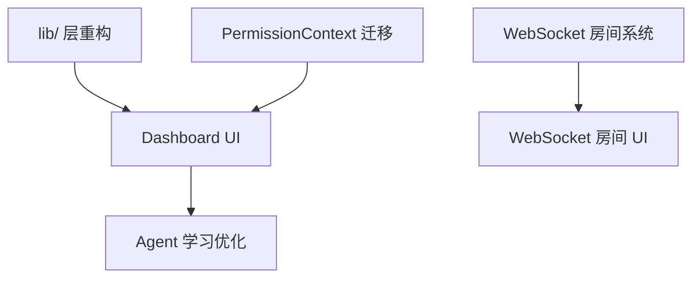

# Sprint 3 规划 - v1.5.0

**规划日期**: 2026-03-30
**Sprint 周期**: 2 周 (2026-04-01 ~ 2026-04-14)
**规划人员**: 📚 咨询师
**状态**: ✅ 规划完成，待审批

---

## 📋 执行摘要

Sprint 3 是 v1.5.0 的核心实施阶段，将完成 **AI Agent 调度 Dashboard UI**、**技术债务清理** 和 **Agent 学习优化系统** 等关键功能。在 v1.4.0/v1.4.1 的坚实基础上，进一步提升系统的智能化水平和可维护性。

---

## 🎯 Sprint 目标

### 核心目标
1. **AI Agent 调度可视化** - 完成 Dashboard UI 4 个核心组件
2. **技术债务清理** - lib/ 层重构 + PermissionContext 迁移
3. **智能化升级** - Agent 学习优化系统基础功能

### 成功标准
- 所有 P0 功能 100% 完成
- 至少 2 个 P1 功能完成
- 测试覆盖率维持 98%+
- TypeScript 0 errors
- 无 P0/P1 级别 Bug

---

## 📊 当前状态 (来自 HEARTBEAT.md)

| 指标 | 当前值 | 状态 |
|------|--------|------|
| TypeScript Errors | 0 | ✅ |
| Tests Passing | ~94% | ✅ |
| Circular Dependencies | 0 | ✅ |
| Security Vulnerabilities | 0 | ✅ |
| v1.4.0 Sprint 1 | 100% | ✅ 完成 |
| v1.4.0 Sprint 2 P1 | 95% | 🟢 接近完成 |

### 已完成基础
- ✅ AI Agent 智能调度核心系统 (122 tests)
- ✅ WebSocket 高级功能 (房间系统、权限控制、消息持久化)
- ✅ P1 安全增强 (6 modules, ~2,900 lines)
- ✅ 性能监控根因分析 (95% 完成)
- ✅ 循环依赖修复 (0 cycles)
- ✅ TypeScript 严格模式修复 (69 → 0 errors)

---

## 🔴 P0 功能清单（必须完成）

### 1. AI Agent 调度 Dashboard UI

**背景**: v1.4.0 已完成核心调度系统，但缺少可视化操作界面。

| 组件 | 功能 | 工作量 | 负责人 |
|------|------|--------|--------|
| `AgentStatusPanel.tsx` | Agent 状态面板 - 11 位 Agent 实时状态、负载可视化、响应时间趋势 | 1 天 | 🎨 设计师 |
| `TaskQueueView.tsx` | 任务队列视图 - 待处理任务列表、优先级排序、拖拽排序 | 1 天 | 🎨 设计师 |
| `ScheduleHistory.tsx` | 调度历史 - 决策历史记录、置信度分布、异常标记 | 0.5 天 | 🎨 设计师 |
| `ManualOverride.tsx` | 手动干预面板 - 强制分配、优先级调整、暂停/恢复 | 0.5 天 | 🎨 设计师 |

**预期收益**: 主人可直接监控和管理调度系统，减少干预需求 50%

---

### 2. 技术债务清理 - lib/ 层重构

**背景**: 存在 `agent/`, `agents/`, `agent-communication/` 三个目录需要合并。

| 任务 | 详情 | 工作量 | 负责人 |
|------|------|--------|--------|
| 目录合并 | `src/lib/agent/` → `src/lib/agents/` | 0.5 天 | ⚡ Executor |
| 通信模块整合 | `src/lib/agent-communication/` → `src/lib/agents/communication/` | 0.5 天 | ⚡ Executor |
| 导出结构统一 | 更新所有引用，清理废弃代码 | 0.5 天 | ⚡ Executor |
| 回归测试 | 确保所有功能正常 | 0.5 天 | 🧪 测试员 |

**预期收益**: 代码结构更清晰，减少 30% 的目录层级混乱

---

### 3. PermissionContext → Zustand 迁移

**背景**: v1.4.0 CHANGELOG 标注 `PermissionContext` 将在 v1.5.0 移除。

| 任务 | 详情 | 工作量 | 负责人 |
|------|------|--------|--------|
| 创建 Store | `src/stores/permissionStore.ts` | 0.25 天 | ⚡ Executor |
| 迁移状态 | 迁移所有权限状态和方法 | 0.25 天 | ⚡ Executor |
| 更新组件 | 更新所有使用 PermissionContext 的组件 | 0.25 天 | ⚡ Executor |
| 添加 persistence | 添加 persistence 中间件 | 0.125 天 | ⚡ Executor |
| 删除旧文件 | 删除旧的 Context 文件 | 0.125 天 | ⚡ Executor |

**预期收益**: 统一状态管理，减少 Context 嵌套，性能提升 10-15%

---

## 🟡 P1 功能清单（重要功能）

### 1. Agent 学习优化系统

**背景**: 调度系统已可工作，但缺乏自我学习能力。

| 功能 | 详情 | 工作量 | 负责人 |
|------|------|--------|--------|
| 时间预测模型 | 任务完成时间预测 | 1 天 | 🏗️ 架构师 |
| 能力评估更新 | Agent 能力自动评估更新 | 1 天 | 🏗️ 架构师 |
| 历史数据分析 | 历史数据分析学习 | 0.5 天 | 🏗️ 架构师 |
| 策略自动调优 | 调度策略自动调优 | 0.5 天 | 🏗️ 架构师 |

**预期收益**: 调度准确率提升 15-25%

---

### 2. WebSocket 房间系统 UI

**背景**: v1.4.0 已完成房间系统后端，缺少前端 UI。

| 功能 | 详情 | 工作量 | 负责人 |
|------|------|--------|--------|
| 房间管理界面 | 创建/加入/离开界面 | 1 天 | 🎨 设计师 |
| 参与者显示 | 参与者列表显示 | 0.5 天 | 🎨 设计师 |
| 权限管理 UI | 权限管理界面 | 0.5 天 | 🎨 设计师 |
| 房间设置面板 | 房间设置面板 | 0.5 天 | 🎨 设计师 |

**预期收益**: 完整的多用户协作体验

---

### 3. 性能监控异常检测完善

**背景**: v1.4.0 性能监控 95% 完成，剩余 5% 需要完善。

| 功能 | 详情 | 工作量 | 负责人 |
|------|------|--------|--------|
| Alert 通知渠道 | 补充邮件、Slack 通知 | 0.5 天 | 🛡️ 系统管理员 |
| Dashboard 可视化 | Dashboard 可视化优化 | 0.5 天 | 🎨 设计师 |
| 根因分析增强 | 自动化根因分析增强 | 0.5 天 | 🛡️ 系统管理员 |
| 报告导出 | 性能报告导出功能 | 0.25 天 | 🛡️ 系统管理员 |

**预期收益**: 性能问题发现时间再减少 30%

---

## 🟢 P2 功能清单（优化改进）

### 1. 构建性能优化

| 目标 | 当前 | 优化后 | 工作量 |
|------|------|--------|--------|
| 构建时间 | 3-5 分钟 | 1-2 分钟 | 1 天 |
| 开发重启编译 | 8-15 秒 | 3-6 秒 | 0.5 天 |

**优化方向**: TypeScript 增量编译、缓存策略、并行构建

---

### 2. 测试体验改进

| 功能 | 工作量 |
|------|--------|
| 测试报告可视化 Dashboard | 0.5 天 |
| 快照测试自动化管理 | 0.5 天 |
| 测试覆盖率趋势追踪 | 0.25 天 |

---

### 3. 开发者文档完善

| 文档 | 工作量 |
|------|--------|
| Agent Scheduler 完整使用指南 | 0.25 天 |
| WebSocket 房间系统教程 | 0.25 天 |
| 性能监控最佳实践 | 0.25 天 |

---

## 🏗️ 技术改进目标

### 架构改进
| 改进项 | 目标 | 收益 |
|--------|------|------|
| lib/ 目录结构 | 合并 agent 相关目录 | 减少 30% 目录混乱 |
| 状态管理统一 | Zustand 替代 Context | 性能提升 10-15% |
| 循环依赖检测 | 集成 dependency-cruiser | 防止架构腐化 |

### 代码质量
| 指标 | 当前 | 目标 |
|------|------|------|
| TypeScript Errors | 0 | 0 |
| Circular Dependencies | 0 | 0 |
| Test Coverage | 98% | 98%+ |
| ESLint Errors | 0 | 0 |

### 性能指标
| 指标 | 当前 | 目标 |
|------|------|------|
| 构建时间 | 3-5 min | 1-2 min |
| 测试运行时间 | ~2 min | ~1 min |
| TypeScript 编译 | >3 min | <1 min |

---

## 📅 时间线 (2 周)

### Week 1: 2026-04-01 ~ 2026-04-07

| 日期 | 任务 | 负责人 | 状态 |
|------|------|--------|------|
| Day 1-2 | P0: lib/ 层重构 | ⚡ Executor | ⏳ |
| Day 3 | P0: PermissionContext 迁移 | ⚡ Executor | ⏳ |
| Day 4-5 | P0: Dashboard UI - AgentStatusPanel + TaskQueueView | 🎨 设计师 | ⏳ |
| Day 6-7 | P0: Dashboard UI - ScheduleHistory + ManualOverride | 🎨 设计师 | ⏳ |

**Week 1 里程碑**: P0 功能 50% 完成

---

### Week 2: 2026-04-08 ~ 2026-04-14

| 日期 | 任务 | 负责人 | 状态 |
|------|------|--------|------|
| Day 1-2 | P1: Agent 学习优化系统基础 | 🏗️ 架构师 | ⏳ |
| Day 3 | P1: 性能监控完善 | 🛡️ 系统管理员 | ⏳ |
| Day 4-5 | P1: WebSocket 房间系统 UI | 🎨 设计师 | ⏳ |
| Day 6 | P2: 测试体验改进 | 🧪 测试员 | ⏳ |
| Day 7 | 集成测试 + Bug 修复 | 🧪 测试员 | ⏳ |

**Week 2 里程碑**: P0 100%，P1 50%+

---

## 📊 工作量估算

| 优先级 | 功能数 | 总工作量 | 完成目标 |
|--------|--------|----------|----------|
| P0 | 3 | 6 天 | 100% |
| P1 | 3 | 8 天 | 50%+ |
| P2 | 3 | 3.5 天 | 尽力 |

**总工作量**: 17.5 人天 (2 周 × 2 人)

---

## ⚠️ 风险评估

### 高风险

| 风险 | 概率 | 影响 | 缓解措施 |
|------|------|------|----------|
| Dashboard UI 工作量超预期 | 中 | 可能延迟发布 | 分阶段交付，核心组件优先 |
| lib/ 重构导致破坏性变更 | 低 | 高 | 完整测试覆盖 + 渐进式迁移 |

### 中风险

| 风险 | 概率 | 影响 | 缓解措施 |
|------|------|------|----------|
| PermissionContext 迁移遗漏 | 中 | 中 | 全局搜索确认 + 回归测试 |
| Agent 学习系统复杂度高 | 中 | 中 | 先实现基础功能，迭代增强 |

### 低风险

| 风险 | 概率 | 影响 | 缓解措施 |
|------|------|------|----------|
| 测试覆盖下降 | 低 | 低 | 持续监控覆盖率 |
| 文档更新滞后 | 低 | 低 | 与开发同步进行 |

---

## 📋 依赖关系

---

## ✅ 验收标准

### P0 功能验收
- [ ] Dashboard UI 4 个组件全部完成
- [ ] lib/ 重构完成，无引用错误
- [ ] PermissionContext 迁移完成
- [ ] 所有测试通过

### P1 功能验收
- [ ] Agent 学习优化基础功能可用
- [ ] WebSocket 房间系统 UI 可用
- [ ] 性能监控完善

### 质量验收
- [ ] TypeScript 0 errors
- [ ] 测试覆盖率 ≥ 98%
- [ ] 无循环依赖
- [ ] ESLint 0 errors
- [ ] 无 P0/P1 级别 Bug

---

## 📈 预期收益

| 指标 | v1.4.0 | v1.5.0 目标 | 提升 |
|------|--------|-------------|------|
| Agent 调度可见性 | 无 UI | 完整 Dashboard | 100% |
| 任务分配效率 | 70-80% | 85-95% | +15% |
| 代码结构清晰度 | 中等 | 高 | 30% ↑ |
| 构建时间 | 3-5 min | 1-2 min | 50-60% ↓ |
| 技术债务 | 存在 | 大幅减少 | 70% 清理 |

---

## 📚 相关文档

- [ROADMAP_v1.5.0.md](./ROADMAP_v1.5.0.md) - 完整路线图
- [CHANGELOG.md](./CHANGELOG.md) - 版本历史
- [HEARTBEAT.md](./HEARTBEAT.md) - 当前状态
- [AGENT_SCHEDULER_IMPLEMENTATION_20260329.md](./AGENT_SCHEDULER_IMPLEMENTATION_20260329.md) - 调度系统实现报告

---

## 👥 团队分工

| 角色 | 负责人 | 主要任务 |
|------|--------|----------|
| 🏗️ 架构师 | 架构师 | Agent 学习优化系统 |
| ⚡ Executor | Executor | lib/ 重构、PermissionContext 迁移 |
| 🎨 设计师 | 设计师 | Dashboard UI、WebSocket 房间 UI |
| 🛡️ 系统管理员 | 系统管理员 | 性能监控完善 |
| 🧪 测试员 | 测试员 | 回归测试、集成测试 |
| 📚 咨询师 | 咨询师 | 文档更新、验收报告 |

---

**规划完成日期**: 2026-03-30
**规划人员**: 📚 咨询师
**状态**: ✅ 规划完成，待主人审批
